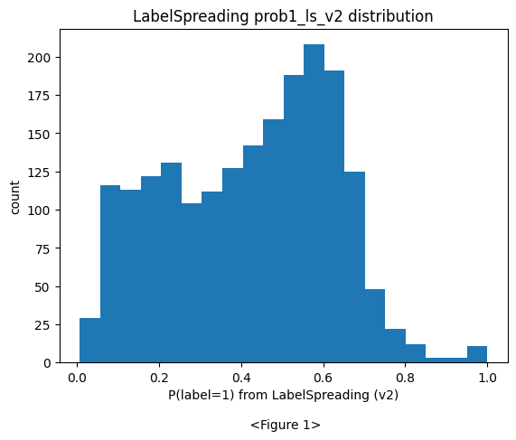
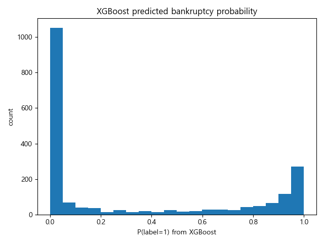
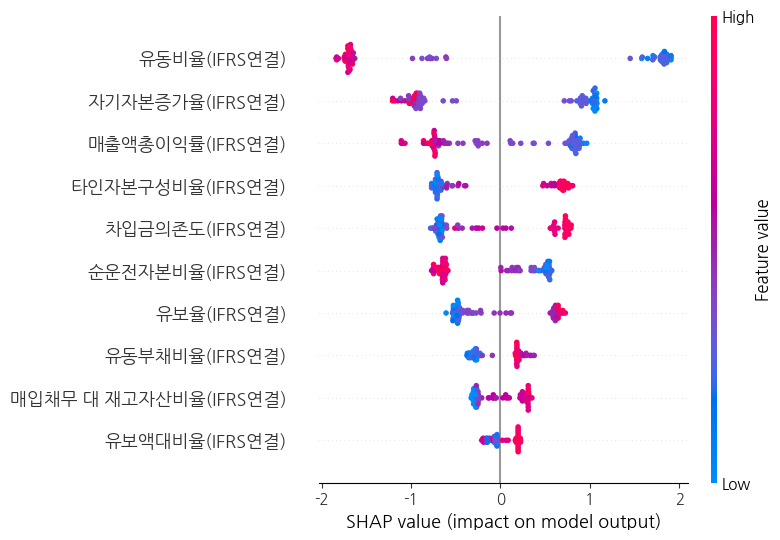
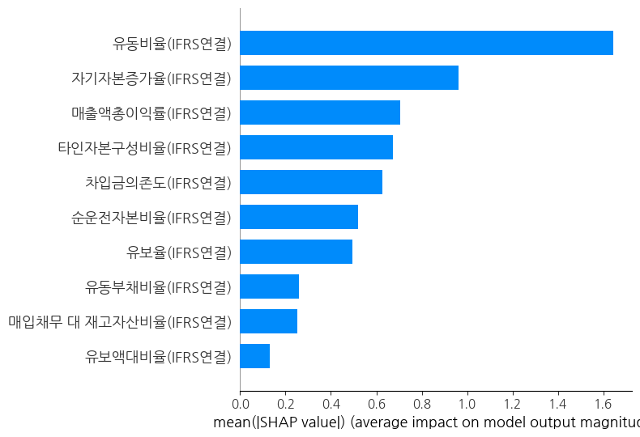
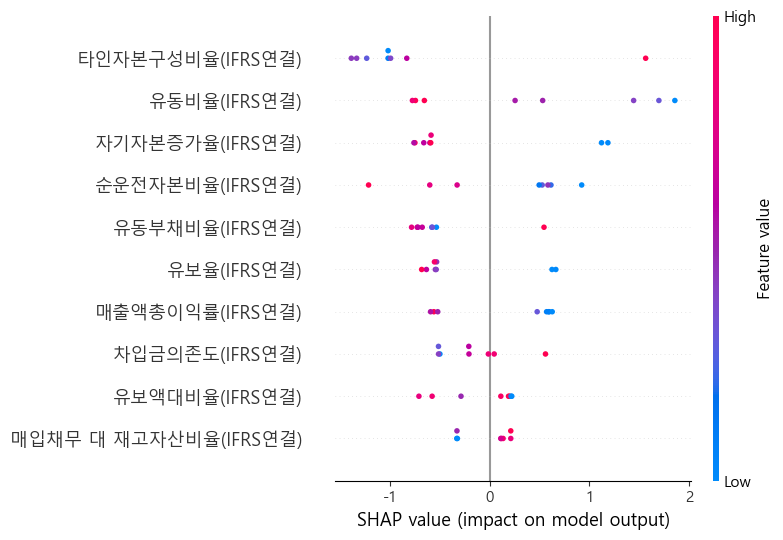

# Corporate Bankruptcy Prediction (기업 부도 예측)

공개된 재무제표만으로 부도 위험이 높은 기업을 사전에 식별할 수 있을까?

Altman Z-Score 같은 전통적 부도 예측 모델보다 예측 정확도와 실용성이 높은 **현대형 부도 위험 예측 모델**을 설계하고, 실제 국내 상장 제조기업 데이터에 적용해 실효성을 검증한 프로젝트입니다. (비즈니스 애널리틱스 수업 팀 프로젝트)

**핵심 접근**: 소수의 확실한 라벨(81개) + 대규모 미라벨 데이터 → **Label Spreading(반지도 학습)** 으로 부도 확률 전파 → pseudo-labeling → **XGBoost** 학습 → **SHAP**으로 해석

| 평가 | 결과 |
|---|---|
| Hold-out test (17개, 24년) | **Accuracy 94.1%** · 부도(1) recall 0.80 / precision 1.00 |
| 외부 검증 (23년 변형의견 기업 36개) | **Recall 77.8%** (28/36 탐지) |

## 배경 및 문제 정의

- 기업 신용등급·외부 평가 지표는 존재하지만, 일반 소비자나 투자자가 미리 인지하거나 접근하기 어렵습니다.
- 부도와 같은 극단적 이벤트는 이미 재무구조에 심각한 이상이 누적된 경우가 많습니다.
- 기존 Altman Z-Score(1968)는 5개 재무비율의 선형 결합으로 파산 가능성을 판정하는 전통 지표로, 비선형 패턴이나 변수 간 상호작용을 반영하지 못합니다.

## 데이터

- **수집**: TS2000을 통해 코스피 + 코스닥 상장 제조기업의 **2024년 재무 데이터** 수집 (약 2,400개사)
- **라벨링 기준** (총 81개 기업에 라벨 부여)
  - `1` (부도 위험, 31개): 감사보고서 변형(비적정) 의견 기업 중 부도의 원인이 되는 **계속기업 관련 문단**이 있는 기업
  - `0` (정상, 50개): Altman Z-Score가 정상 기준치에 속하면서 유동비율이 높은 상위 기업
  - 나머지 기업은 라벨 없이 반지도 학습에 활용
- **train/test 분리**: 라벨 81개 중 **17개(20%)를 test set으로 분리**하고, 변환기(PowerTransformer)와 모델은 train에만 적합 → 데이터 누수 방지

## 분석 과정

### 1. 가설 검정

라벨 0/1 그룹 간 재무비율 차이의 유의성 검증:

1. 정규성 검정 → 표본 수가 적고(50 vs 31) 정규성 불만족
2. 등분산성 검정
3. **Mann-Whitney U test** (비모수 검정)로 유의미한 변수 도출

### 2. 데이터 정제

- **다중공선성 제거**: 재무비율 특성상 변수 간 다중공선성이 매우 높아 VIF 확인 후 유의미한 변수만 선별 (타인자본구성비율·차입금의존도는 VIF가 다소 높아도 부도 판단에 유의미하다고 판단하여 포함)
- **최종 사용 변수 (10개, IFRS연결 기준)**: 타인자본구성비율, 유동비율, 순운전자본비율, 차입금의존도, 유보액대비율, 자기자본증가율, 유동부채비율, 유보율, 매출액총이익률, 매입채무 대 재고자산비율
- **이상치 처리**: 이상치가 라벨 0/1/미라벨에 각각 ~10%씩 고르게 분포 → 단순 제거 대신 상·하위 1% winsorize를 시도했으나, test set 항목이 이상치로 대치되는 문제가 있어 최종 모델에서는 제외
- **왜도 보정**: 재무비율에 음수가 많아 log1p 대신 **Yeo-Johnson 변환** 사용. `PowerTransformer(method='yeo-johnson', standardize=True)`가 표준화까지 포함하므로 별도 스케일러 불필요 (초기 RobustScaler는 성능이 나오지 않아 교체 → 성능 향상)

### 3. 모델링

**① Label Spreading (반지도 학습)**

- 0/1 라벨에 대한 확신은 있었으나 나머지 대다수 기업은 라벨이 없음
- 단순 이진분류보다 **"부도 확률"** 에 집중하고자 반지도 학습으로 라벨 미부여 기업에 부도 확률을 전파
- 파라미터: `kernel='rbf', alpha=0.5, gamma=0.2, max_iter=50`



**② Pseudo-labeling**

- Label Spreading의 `predict_proba`는 클래스 확률 그 자체가 아니라 이웃 영향력의 지분에 가까움 → 보수적 cutoff 적용
- **0.9 이상 → 1, 0.4 이하 → 0**, 중간 구간은 학습에서 제외 (원 라벨 81개는 그대로 유지)

**③ XGBoost**

- pseudo-label 데이터로 학습 (`n_estimators=300, max_depth=3, learning_rate=0.05, subsample=0.8, colsample_bytree=0.8`)
- 트리 기반 부스팅이 부도 예측에 유리한 이유: 비선형 패턴 학습, 이상치 영향 최소, feature 자동 선택, 상호작용 자동 학습, class imbalance 대응 및 threshold 최적화 용이
- 부도 확률 **threshold 0.8~0.81**에서 클래스 1의 recall이 가장 높아 채택



### 4. 성능 및 검증

**Hold-out test set (17개)**

```
[[12  0]
 [ 1  4]]
              precision    recall  f1-score   support
           0       0.92      1.00      0.96        12
           1       1.00      0.80      0.89         5
    accuracy                           0.94        17
```

**23년 외부 검증 (변형의견 + 계속기업 존속 의문 기업 36개, 라벨 전부 1)**

```
[[ 0  0]
 [ 8 28]]
              precision    recall  f1-score   support
           1       1.00      0.78      0.88        36
    accuracy                           0.78
```

- 부도 시그널은 한순간이 아니라 점진적으로 누적됨 → 24년 라벨 1 기업들의 **23년 지표**를 입력했을 때도 상당수가 높은 부도 확률로 예측되어, 1년 전 시점에서의 조기 경보 가능성을 확인

### 5. 해석 (SHAP)

어떤 재무비율이 부도 판단에 가장 큰 영향을 미치는지 SHAP(TreeExplainer)으로 분석 (누수 없는 train/test 분리 파이프라인의 모델로 생성):




- **순운전자본비율**이 낮을수록, **유동비율**이 낮을수록, **자기자본증가율**이 낮을수록 부도 방향으로 크게 작용 — 단, 라벨 0 선정 기준에 유동비율이 포함되어 효과가 과대평가될 수 있음 (한계 참고)
- **타인자본구성비율**, 유동부채비율, 차입금의존도가 높을수록 부도 방향
- 기여도 상위 4개: 순운전자본비율 > 타인자본구성비율 > 유동비율 > 자기자본증가율

### 6. 오분류 분석

FN(실제 1인데 0으로 예측) 8개 기업을 SHAP로 개별 분석:



- 일부는 23년에는 적정 의견이었으나 24년에 상황이 급격히 악화되어 재무비율만으로는 예측 불가능한 기업
- 일부는 계속기업 관련 위험이 있으나 **회사가 자료를 제공하지 않아** 의견이 변형된 기업 → 재무비율만으로 판단 불가

→ 재무비율은 부도 판단의 기초 토대를 제공하지만, **재무제표 주석·감사보고서 등을 함께 활용해야 입체적인 분석이 가능**함을 확인

## 한계

- 유동비율을 기준으로 라벨 0을 선정하여 해당 변수의 효과가 과대평가될 수 있음
- 재무비율은 양방향 해석이 가능함 (같은 비율도 맥락에 따라 위험/정상 신호로 읽힐 수 있음)
- hold-out test가 17개로 작아 지표의 신뢰구간이 넓음 → 23년 36개 외부 검증으로 보완

## 저장소 구조

```
├── README.md
├── images/                     # 결과 이미지 (노트북 출력)
└── notebooks/
    └── BA_project.ipynb        # 메인 파이프라인 (train/test 분리 + SHAP)
```
